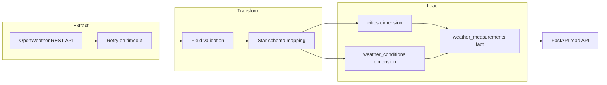

# Weather ETL Pipeline


A production-style **Extract–Transform–Load (ETL)** pipeline that pulls current weather from the [OpenWeather API](https://openweathermap.org/api), validates and transforms it, and loads it into a **PostgreSQL star schema** for analytics.

Built to demonstrate skills commonly listed in data engineering job posts: ETL design, dimensional modeling, REST integration, retries, validation, SQLAlchemy, **FastAPI**, pytest, Docker, and environment-based configuration.

## Problem & solution

Weather APIs return nested JSON that is awkward for reporting. This project:

1. **Extracts** current conditions for multiple cities via REST.
2. **Transforms** responses into dimension and fact shapes with validation.
3. **Loads** into PostgreSQL using idempotent dimension lookups and fact inserts.

The result is a small analytics warehouse you can query with standard SQL (e.g. latest temperature per city, trends over time).

## Architecture



### Project layout

```
weather-etl-pipeline/
├── config/config.py      # Environment-driven settings
├── src/
│   ├── extract.py        # API client + retry
│   ├── transform.py      # Validation + mapping
│   ├── load.py           # SQLAlchemy loader
│   └── utils.py          # Logging, retry decorator, helpers
├── sql/schema.sql        # Star schema DDL + views
├── tests/                # pytest unit tests (extract, transform)
├── api/                  # FastAPI read layer
├── main.py               # Pipeline orchestration
├── Dockerfile            # ETL application image
├── Dockerfile.api        # API service image
├── docker-compose.yml    # PostgreSQL + ETL + API services
├── docs/                 # Demo script, resume bullets, example output
├── .github/workflows/    # CI (lint, test, coverage)
├── LICENSE               # MIT
└── Makefile              # Common commands
```

## Tech stack

| Area | Technology |
|------|------------|
| Language | Python 3.10+ |
| API | `requests`, OpenWeather Current Weather |
| Database | PostgreSQL 15, star schema |
| ORM / SQL | SQLAlchemy 2.x (raw SQL via `text()`) |
| Config | `python-dotenv`, `config/config.py` |
| Testing | `pytest`, `pytest-mock`, `unittest.mock` |
| Read API | FastAPI, Uvicorn, OpenAPI |
| Containers | Docker Compose (Postgres, ETL, API) |
| Tooling | `black`, `flake8`, `Makefile`, `pyproject.toml` |

## Star schema

Schema namespace: `weather`.

| Table | Type | Role |
|-------|------|------|
| `cities` | Dimension | City name, country, coordinates |
| `weather_conditions` | Dimension | Condition type (Clear, Rain, …) |
| `weather_measurements` | Fact | Temperature, humidity, wind, etc. per city & time |

**Grain:** one row per `city_id` + `measurement_timestamp` (enforced with `UNIQUE`).

**Idempotency:**

- Dimensions: lookup by natural key, insert only if missing.
- Facts: `ON CONFLICT (city_id, measurement_timestamp) DO NOTHING`.

**Analytics view:** `weather.latest_weather` — most recent measurement per city.

## Prerequisites

- Python 3.10+
- Docker & Docker Compose (for PostgreSQL)
- [OpenWeather API key](https://openweathermap.org/api) (free tier is enough)

## Quick start

### 1. Clone and configure

```bash
git clone <your-repo-url>
cd weather-etl-pipeline
cp .env.example .env
# Edit .env and set OPENWEATHER_API_KEY
```

### 2. Install dependencies

```bash
python3 -m venv .venv
source .venv/bin/activate
make install-dev
```

### 3. Start database and apply schema

```bash
make db-init
```

This starts Postgres on **localhost:5435** and runs `sql/schema.sql`.

> **Port conflict?** If another project uses 5433 (e.g. another Postgres container), this project uses **5435** by default. Set `DB_PORT` in `.env` if you need a different port.

### 4. Run the pipeline

```bash
make run
```

Logs are written to `logs/weather_etl.log` and stdout.

### 5. Run with Docker (full stack)

Requires a `.env` file with `OPENWEATHER_API_KEY` set. Postgres schema is applied automatically on first container start.

```bash
make docker-up
```

This starts PostgreSQL (with `sql/schema.sql` init) and runs the ETL container once. Use `make docker-down` to stop.

Inside Docker, the ETL service connects to `postgres:5432` (overrides `DB_HOST` / `DB_PORT` from `.env`).

### 6. Run the read API

After data is loaded (`make run` or `make docker-up`):

```bash
make db-up          # if Postgres is not already running
make api-run        # local: http://localhost:8000/docs
# or
make api-up         # Docker: Postgres + API on port 8000
```

| Endpoint | Description |
|----------|-------------|
| `GET /health` | API and database health |
| `GET /api/v1/weather/latest` | Latest measurement per city |
| `GET /api/v1/cities` | List tracked cities |
| `GET /api/v1/cities/{id}/measurements` | History (`limit`, `from`, `to`) |
| `GET /api/v1/analytics/temperature-summary` | Avg temp by city (rolling days) |
| `GET /api/v1/analytics/extremes` | Hottest / coldest in latest snapshot |
| `GET /api/v1/analytics/etl-runs` | Recent pipeline runs |

Interactive docs: **http://localhost:8000/docs**

## Makefile commands

| Command | Description |
|---------|-------------|
| `make help` | Show available targets |
| `make install` | Runtime dependencies only |
| `make install-dev` | Runtime + test + lint tools |
| `make db-up` | Start PostgreSQL container |
| `make db-down` | Stop containers |
| `make db-init` | Start DB + apply schema |
| `make docker-build` | Build ETL Docker image |
| `make docker-up` | Start Postgres + run ETL in Docker |
| `make docker-down` | Stop full Docker stack |
| `make api-run` | Run FastAPI locally (port 8000) |
| `make api-up` | Start Postgres + API in Docker |
| `make run` | Execute ETL pipeline (local Python) |
| `make test` | Run unit tests |
| `make test-cov` | Tests with coverage report |
| `make test-integration` | Integration tests (Postgres required) |
| `make lint` | `flake8` + `black --check` |
| `make format` | Auto-format with `black` |
| `make pre-commit` | Install and run pre-commit hooks |

## Testing

```bash
make test
# or with coverage:
make test-cov
```

- **89** unit tests across extract, transform, load, utils, models, API, `etl_runs`, and pipeline orchestration.
- Overall coverage ~**90%** (`src/`); CI fails below **70%**.
- Loader tests mock SQLAlchemy — no live database required for `make test`.

Tests use mocked HTTP and database responses — no live API key required for `make test`.

### Integration tests (Postgres)

```bash
make db-up
make test-integration
```

Uses a mocked OpenWeather API and a real PostgreSQL instance. CI runs these in a separate job with a Postgres service container.

### Pre-commit (optional, local)

```bash
pip install -r requirements-dev.txt
make pre-commit
```

## Sample analytics SQL

Connect to the database:

```bash
docker compose exec postgres psql -U postgres -d weather_analytics
```

**Latest weather per city** (uses built-in view):

```sql
SELECT * FROM weather.latest_weather ORDER BY city_name;
```

**Average temperature by city (last 7 days):**

```sql
SELECT
    c.city_name,
    ROUND(AVG(wm.temperature_celsius)::numeric, 2) AS avg_temp_c
FROM weather.weather_measurements wm
JOIN weather.cities c ON wm.city_id = c.city_id
WHERE wm.measurement_timestamp >= NOW() - INTERVAL '7 days'
GROUP BY c.city_name
ORDER BY avg_temp_c DESC;
```

**Hottest city in the latest snapshot:**

```sql
SELECT city_name, temperature_celsius, measurement_timestamp
FROM weather.latest_weather
ORDER BY temperature_celsius DESC
LIMIT 1;
```

**Row counts by table:**

```sql
SELECT 'cities' AS table_name, COUNT(*) FROM weather.cities
UNION ALL
SELECT 'conditions', COUNT(*) FROM weather.weather_conditions
UNION ALL
SELECT 'measurements', COUNT(*) FROM weather.weather_measurements;
```

## Design decisions

| Decision | Rationale |
|----------|-----------|
| Star schema | Separates slowly changing attributes (city, condition) from measurements; familiar to analysts and BI tools |
| Raw SQL in loader | Explicit control over upserts and `ON CONFLICT`; easy to read in interviews |
| Retry decorator | Transient network timeouts on extract; configurable `MAX_RETRIES` / `RETRY_DELAY` |
| Pydantic validation | Schema-checked API and transformed records before load |
| `etl_runs` metadata | Each pipeline run recorded with counts and status |
| Structured logging | Optional JSON logs with `run_id`, stage, and `duration_ms` |
| Parallel extract | `ThreadPoolExecutor` with configurable workers and rate limiting |
| Exit codes | `0` success, `1` failure, `2` partial (for schedulers/CI) |
| Env-based config | Twelve-factor style; secrets stay in `.env` (never committed) |
| Mocked unit tests | Fast, deterministic CI without burning API quota |

## Environment variables

See [.env.example](.env.example) for all variables. Required:

| Variable | Description |
|----------|-------------|
| `OPENWEATHER_API_KEY` | API key from OpenWeather |
| `DB_PASSWORD` | PostgreSQL password (defaults work with `docker-compose.yml`) |

Optional:

| Variable | Description |
|----------|-------------|
| `STRUCTURED_LOGGING` | `true` for JSON logs with `run_id` and stage |
| `LOG_FORMAT` | `text` (default) or `json` |
| `EXTRACT_WORKERS` | Parallel API fetch threads (default `4`) |
| `API_RATE_LIMIT_DELAY` | Seconds between API calls (default `0.2`) |

**Analytics examples:** [`sql/analytics_examples.sql`](sql/analytics_examples.sql)

## Example output

Representative pipeline run (full log: [`docs/example-output.txt`](docs/example-output.txt)):

```
==================================================
WEATHER ETL PIPELINE
==================================================

... Successfully fetched weather data for 10/10 cities
... Transformed 10 records
... Loaded 10 records, 0 failures
... ETL run finished: status=success

 Pipeline completed successfully!
```

## Portfolio resources

| Document | Use for |
|----------|---------|
| [`docs/DEMO_SCRIPT.md`](docs/DEMO_SCRIPT.md) | 2-minute interview walkthrough |
| [`docs/RESUME_BULLETS.md`](docs/RESUME_BULLETS.md) | CV / LinkedIn copy |
| [`docs/example-output.txt`](docs/example-output.txt) | Screenshot or README sample output |
| [`CONTRIBUTING.md`](CONTRIBUTING.md) | How to run checks before a PR |

## Roadmap

- **Phase 1** — documentation & tooling ✅
- **Phase 2** — CI, Docker, pre-commit, full unit test suite ✅
- **Phase 3** — Pydantic, `etl_runs`, structured logging, integration tests, parallel extract ✅
- **Phase 4** — FastAPI read API + analytics endpoints ✅
- **Phase 5** — license, badges, demo script, resume bullets ✅

See [ROADMAP.md](ROADMAP.md) for the full timeline (local copy if not on GitHub).

## License

[MIT](LICENSE) — see [LICENSE](LICENSE) for details.
